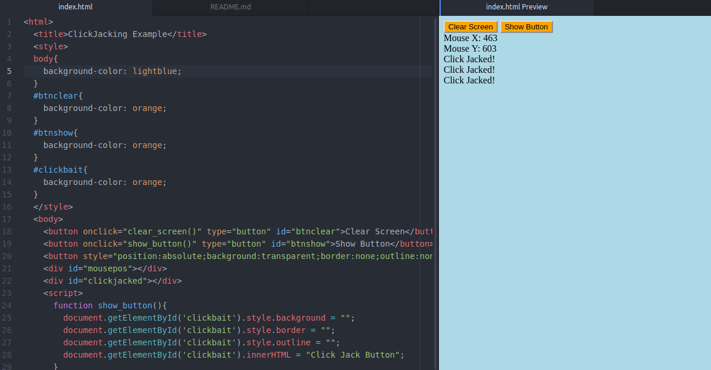

  # About this project
This project aims to show how easy it is to combine javascript and html to perform clickjacking.

  # Setup
  ```bash
  sudo apt-get update
  sudo apt-get install apache2
  sudo /etc/init.d/apache2 start
  git clone https://github.com/lillypad/click-jack.git
  cd click-jack/
  sudo ln -s index.html /var/www/html/index.html
  ```
  Open browser and go to http://127.0.0.1
  
  # Screenshots
  

  - What is clickjacking?
    - Clickjacking (User Interface redress attack, UI redress attack, UI redressing) is a malicious technique of tricking a Web user into clicking on something different from what the user perceives they are clicking on, thus potentially revealing confidential information or taking control of their computer while clicking on seemingly innocuous web pages. (Wikipedia)

  # Benefits of Clickjacking
  - What can criminals gain from click-jacking
    - Getting cost per click or CPC in advertisement campaigns
    - Abusing affiliate programs
    - Gettting likes on pages which users did not intend for publicity
    - Gaining Twitter Followers
    - Gaining access to webcam through flash without users knowledge
    - Downloading and running malware

  # Features
  - Clear Events from Screen
  - Show button which is causing the Clickjacking
  - Debug info shown for mouse tracking
  - Enable and disable clickjacking over certain elements as needed so page retains functionality

  # Where to use this?
  - Penetration Testing Engagements with Phishing Involved
  - Educational Purposes

  # Disclaimer
I am not responsible for misuse of this code be smart.
